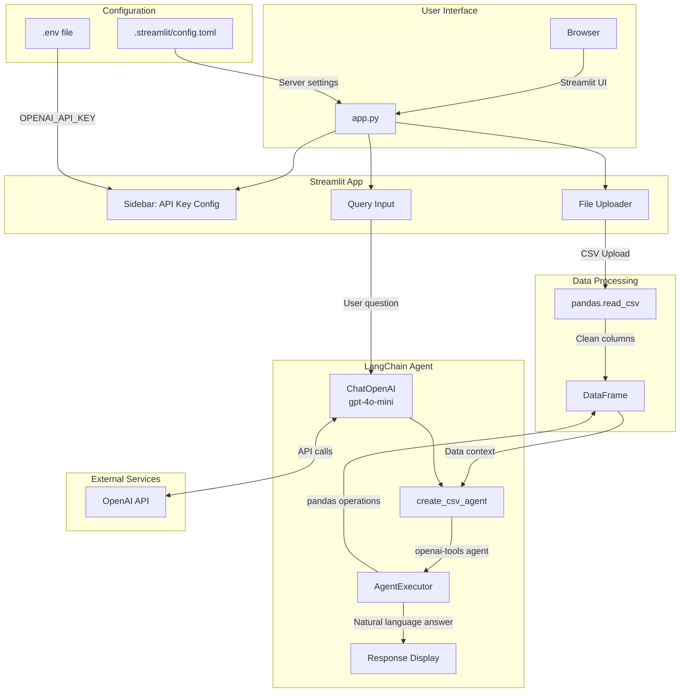
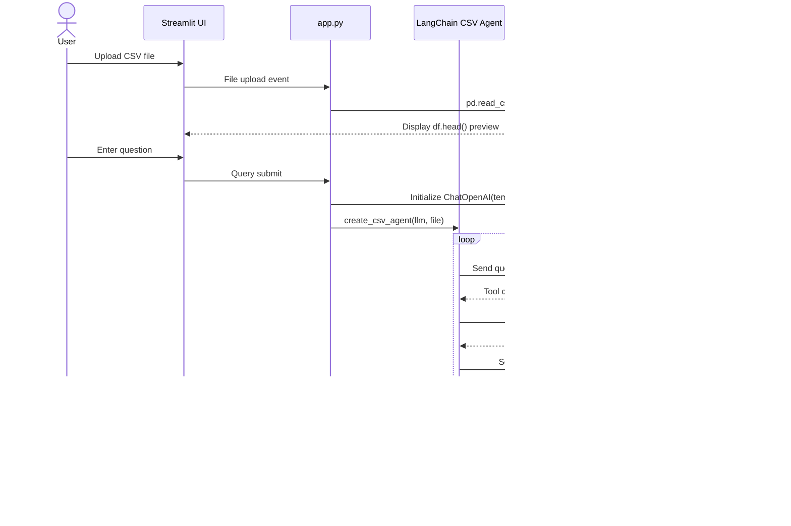
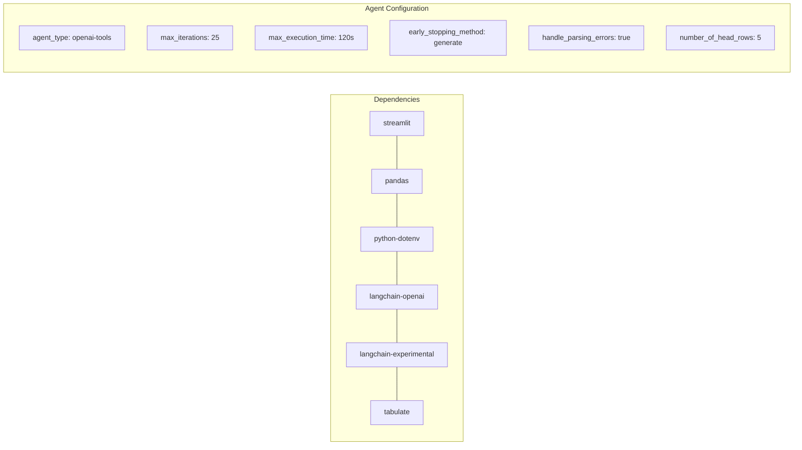

# Architecture

## System Overview

```mermaid
graph TB
    subgraph User Interface
        A[Browser] -->|Streamlit UI| B[app.py]
    end

    subgraph Streamlit App
        B --> C[Sidebar: API Key Config]
        B --> D[File Uploader]
        B --> E[Query Input]
    end

    subgraph Data Processing
        D -->|CSV Upload| F[pandas.read_csv]
        F -->|Clean columns| G[DataFrame]
    end

    subgraph LangChain Agent
        E -->|User question| H[ChatOpenAI<br/>gpt-4o-mini]
        G -->|Data context| I[create_csv_agent]
        H --> I
        I -->|openai-tools agent| J[AgentExecutor]
        J -->|pandas operations| G
        J -->|Natural language answer| K[Response Display]
    end

    subgraph External Services
        H <-->|API calls| L[OpenAI API]
    end

    subgraph Configuration
        M[.env file] -->|OPENAI_API_KEY| C
        N[.streamlit/config.toml] -->|Server settings| B
    end
```

## Request Flow

```mermaid
sequenceDiagram
    actor User
    participant UI as Streamlit UI
    participant App as app.py
    participant Agent as LangChain CSV Agent
    participant LLM as OpenAI GPT-4o-mini
    participant DF as pandas DataFrame

    User->>UI: Upload CSV file
    UI->>App: File upload event
    App->>DF: pd.read_csv() + strip columns
    DF-->>UI: Display df.head() preview

    User->>UI: Enter question
    UI->>App: Query submit
    App->>LLM: Initialize ChatOpenAI(temp=0)
    App->>Agent: create_csv_agent(llm, file)
    
    loop Agent Reasoning (max 25 iterations)
        Agent->>LLM: Send question + tool definitions
        LLM-->>Agent: Tool call (python_repl_ast)
        Agent->>DF: Execute pandas operation
        DF-->>Agent: Return result
        Agent->>LLM: Send observation
        LLM-->>Agent: Final answer or next tool call
    end

    Agent-->>App: agent_response["output"]
    App-->>UI: Display answer in chat message
    UI-->>User: See formatted response
```

## Component Details

```mermaid
graph LR
    subgraph Dependencies
        A[streamlit] --- B[pandas]
        B --- C[python-dotenv]
        C --- D[langchain-openai]
        D --- E[langchain-experimental]
        E --- F[tabulate]
    end

    subgraph Agent Configuration
        G[agent_type: openai-tools]
        H[max_iterations: 25]
        I[max_execution_time: 120s]
        J[early_stopping_method: generate]
        K[handle_parsing_errors: true]
        L[number_of_head_rows: 5]
    end
```
